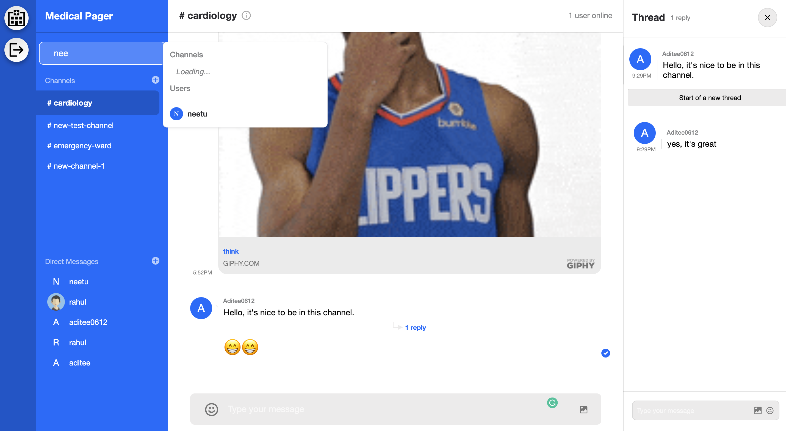
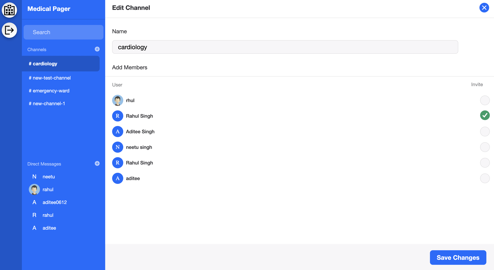

# MedicalPager - chat application
A group/personal chat application built with React, Node, StreamChat API and twilio API.

Medical Pager is a chat application that supports griup chats as well as personal chats. It is built to connect patients with doctors in a fast and efficient way. It also provides functionality to support emoji reactions, replying in threads, sending gifs and also sends SMS notifications when reciever is offline. 

## Technologies
* ReactJS
* Node.js
* Stream Chat API
* Twilio API

## Setup
To install on your local system 
```
$ git clone "git@github.com:aditee-singh/medical-pager.git"
$ cd medical-pager/server
$ npm install
$ npm run dev
$ cd ../client
$ npm install
$ npm run start
```

### Live Preview
[https://medical-pager-aditee.netlify.app/](https://medical-pager-aditee.netlify.app/)

## Preview




